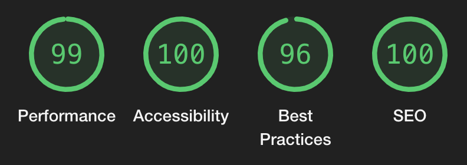

This post is meant to document my process, thoughts and tips on the migration of my [ReCalendar](https://recalendar.me/) personal project from [Create React App](https://create-react-app.dev/) to [Vite](https://vitejs.dev/). It's not meant to be an exhaustive guide. I wanted primarily to document the more interesting (and often frustrating) challenges of such a migration. So that others might benefit from them when scouring random pages on the web, searching for an explanation or solution to a cryptic error message.

Why migrate?
------------

Create React App has been the _de facto_ standard when creating new React apps for years. It's still being recommended on many blog posts. However, [it has not been actively developed for a year](https://github.com/facebook/create-react-app/commits/main/), it has >1.7k open issues and 477 pull requests. Mostly to update the out of date dependencies. In short, it's not a future-proof solution.

As typical in the JavaScript ecosystem, there's plethora of alternatives. I went with [Vite](https://vitejs.dev/), because it promised speed and simplicity. [React.dev has a list](https://react.dev/learn/start-a-new-react-project) of more complex, full-stack options, if that fits your requirements. However, ReCalendar is client-side only by design, does not need any routing, state management is very simple, etc. So Vite seemed like the best choice.

Simplified migration steps
--------------------------

*   Create a new Vite project, most likely [using the provided templates](https://vitejs.dev/guide/#scaffolding-your-first-vite-project). There's official support for many frameworks, and [the community has got you covered for the rest](https://github.com/vitejs/awesome-vite#templates).
*   I was previously using `yarn`, but for the new project, I went with `npm`. My understanding is that `npm` caught up with `yarn` recently in terms of performance and other improvements. So no need for an additional dependency to install.
*   I also went with TypeScript-enabled configuration. It's compatible with JavaScript (which the project is currently written in), but I'm hoping to migrate it to TypeScript in the future, so this gives me that possibility.
*   Copy the source code to the new project. At this point, I'm just trying to make things compile. I went with the simplest approach of just manually re-installing the needed dependencies. There's not that many and since I switched from `yarn` to `npm`, it felt like a proper fresh start.

Gotchas
-------

Overall the code did not require much changes. Most of them were related to how Vite is ["leveraging new advancements in the ecosystem: the availability of native ES modules in the browser"](https://vitejs.dev/guide/why.html). It's a radically different approach to Webpack and Babel that CRA is based on. Vite uses [Rollup](https://rollupjs.org/) under the hood instead.

The majority of the work was squashed into [this commit](https://rollupjs.org/). Two major challenges are covered in the next sections. Other than that, I've taken the chance to clean-up things like `.gitignore` or Eslint configuration. Some other changes/differences include:

*   CRA would inject the correct `script` tag to the main `HTML` file at compile time. In Vite, you simply reference your app's entry point like `[/src/index.jsx](/src/index.jsx)`.
*   The env variables are exposed differently too. For example, `process.env.NODE_ENV === 'development'` becomes `import.meta.env.DEV` (which is a nice built-in boolean). [There's plenty more options](https://vitejs.dev/guide/env-and-mode.html), including HTML env replacement and such.
*   In CRA, I had the root folder for the sources configured so that `import` statements looked like `import PdfPreview from 'components/pdf-preview';`. In Vite (or maybe in general now?), you're supposed to have a clear prefix, for example: `import PdfPreview from '~/components/pdf-preview';`. Which makes sense and I kinda like - local dependencies are clearly different from global/external ones.
    *   I only changed the often suggested `@` prefix to `~`, which makes more sense to me as the "home" designation. `~` is obviously inspired by \*nix conventions, while `@` gives me flashbacks from configuring DNS zones.

### Workers

Since PDF generation inside the browser, on the client side, is a very compute-heavy task, it needs to be done in a worker. Otherwise, the browser would hang for up to minutes at a time. So it's a pretty crucial part of ReCalendar. It was also the source of some frustratingly confusing and misleading errors.

Starting with `ReferenceError: $RefreshReg$ is not defined`. Or it's close cousin, `ReferenceError: $RefreshSig$ is not defined`. What was more bizarre is that it was coming from React components from the configurator. Ones that should not be needed by the worker. Turns out that I had [some constants](https://github.com/klimeryk/recalendar.js/blob/5a292dbb653058989af71ac1284219a97d33bb9c/src/configuration-form/itinerary.jsx#L24) defined in those files that were being used in the PDF worker. Because, you know, magic strings are bad. And it made sense to keep those constants with the components that use them. However, it seems Vite (Rollup?) had troubles handling that and tried to load the UI dependencies (like `@dnd-kit/sortable`) that were not meant to be loaded in a worker. Resulting in the above confusing error.

The solution was simple: move the constants to [a separate file](https://github.com/klimeryk/recalendar.js/blob/5ab3ac71c1c3c8f7a96ed271a092fb57e3c23874/src/lib/itinerary-utils.js). Now the PDF worker had a clear and simple dependency to load.

Next error was much simpler to figure out: `Cannot use import statement outside a module`. I just had to declare the worker as an ES module:

```js
export default defineConfig( {
	// ...
	worker: {
		format: 'es',
		// ...
	},
} );
```

### Day.js dynamic locale loading

A bit of backstory: ReCalendar has awesome community members that helped translate it into 16 languages 💖 However, there's more that could be done! Prompted by [a user issue](https://github.com/klimeryk/recalendar.js/issues/96) requesting another language, I realized that while the configurator requires translations, most of the generated PDF is just days of the week and months. And user-provided strings (which, by definition, they "translate" themselves in whatever language/format they want).

This [gave me an idea](https://github.com/klimeryk/recalendar.js/issues/96#issuecomment-1763503687) to simply expose [all the available locales from Day.js](https://day.js.org/docs/en/i18n/i18n). The [change was quite simple](https://github.com/klimeryk/recalendar.js/commit/f72bfeb9c6d50f258ce9f51edfdeb71d0b355884). However, it relied on `require` to dynamically load the JS files with the selected locale. It needed a method that accepted strings generated from user input (locale selection).

The problem: Vite is built around ES modules. `require` is not available. There's plugins to emulate it, but that's another dependency. However, there's `[import()](https://developer.mozilla.org/en-US/docs/Web/JavaScript/Reference/Operators/import)` for loading modules asynchronously. And [Vite supports it](https://vitejs.dev/guide/features.html#dynamic-import). Perfect, right? Not quite. [It does not work for files from `node_modules`](https://github.com/vitejs/vite/issues/14102) :(

I've tried many workarounds - like creating a symbolic link to maybe trick the process. Even tried copying the files to my `src` folder - after all, they are small and don't change often. However, they are not meant to be loaded from a different package like that, so that was a fail.

What did end up working was using [glob imports](https://vitejs.dev/guide/features.html#glob-import). Through static analysis, they generate a list of all the possible paths to include ([as long as you follow specific guidelines](https://github.com/rollup/plugins/tree/master/packages/dynamic-import-vars#limitations)) and allow you to dynamically load from that list at run time.

That finally made the locale loading work. However, it required two more tweaks:

*   [Needed to move the language change event to before i18next was initialized](https://github.com/klimeryk/recalendar.js/commit/3e74d934fdff3e733cd6e9be7b18c412b31d8030#diff-ec767e14d91498b5b31a4ce826c4596061eb83a47d3dee00f6cbe1078232a75cR14). Otherwise, language detection would run before the event handler is set up. Interesting race condition - this worked with CRA, probably due to luck/different timings.
*   [Made the glob imports eager](https://github.com/klimeryk/recalendar.js/commit/3e74d934fdff3e733cd6e9be7b18c412b31d8030#diff-b9ba40695c69e31208cbf682a6f2e9a0525ca32f9b841ed921d4e3483bc454ccR37) - meaning, they are preloaded. This was an admittedly a lazy and quick workaround to imports being inherently asynchronous now. Which messes with React, as the state change (Day.js changing locale) happens outside the state it monitors. Eager loading preloads them and makes the action synchronous again. Since the locale files are quite small and simple, I figured it's worth the trade-off to finish this migration. And gives me a clear target for optimization in the future.

Performance comparison
----------------------

Now let's try to ask the question: **was it worth it**? (yes, yes it was)

|                                                                            | Create React App                       | Vite |
|----------------------------------------------------------------------------|----------------------------------------|------|
|[Lighthouse](https://developer.chrome.com/docs/lighthouse/overview/) metrics | Same                                   | Same |
|Vulnerabilities                                                              | 67 (39 moderate, 16 high, 12 critical) | 0    |
|`node_modules` size | 215 MB | 188 MB|
| Number of files in `node_modules`|42670|18154|
|DOMContentLoaded|279 ms|117 ms|
|Total app bundle size|3.69 MB|3.26 MB|

This is _not_ an in-depth comparison. I've just looked at a few key metrics. Important caveat is that CRA includes the kitchen sink and more. For example, lots of testing libraries. Which I don't have a use for right now. Vite has [Vitest](https://vitest.dev/) as a separate dependency to add when I finally face the reality that tests are indeed useful, even if the development is mostly done by one person...

### Page load

**No perceptible difference**. I have not tried to squeeze out the smallest bundle for this project (it's on my TODO). So the bundle size is quite large (~3 MB). Then again, it has robust i18n, date and PDF capabilities. `DOMContentLoaded` was halved, but it's already been quite low so hard to say how perceptible it is.

Then again, these tests were done quickly and on a modern MacBook Pro. I need to test them on lower-end machines, where these improvements could make a much more noticeable difference.

### Lighthouse metrics



**Same before and after migration**. Like mentioned above, there's potential for further optimization, but that has not been the focus so far.

### Security audit

**From all sorts of vulnerabilities to zero**. Because CRA has not been updated in more than a year. And even then, it had outdated dependencies. Which leads to many alerts when running a security audit (`npm audit` or `yarn audit`). After the migration, the number simply went to zero, which is great to see.

### Dependencies

**13% less in size, but a staggering 80% less number of files**. I'd guess this is related to the fact that Vite is written in Go, but also that CRA brings in a lot of dependencies around testing and such. Which are optional for Vite. I did not dig further into verifying these assumptions, though. I'll leave that to the reader - or future me ;)

Conclusion
----------

Based on these experiences and results, **would I recommend migrating from CRA to Vite? Yes, definitely**. The challenges and changes were not as extensive as I feared. All metrics improved. And I feel the project has more solid and future-proof foundation now. I'm excited to start working on some new features I've been postponing!
